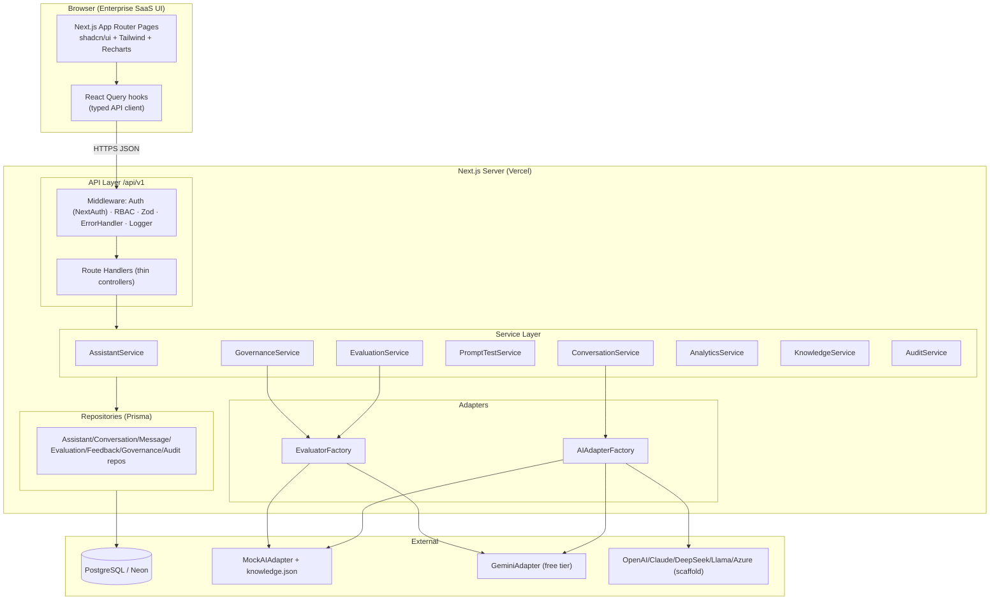
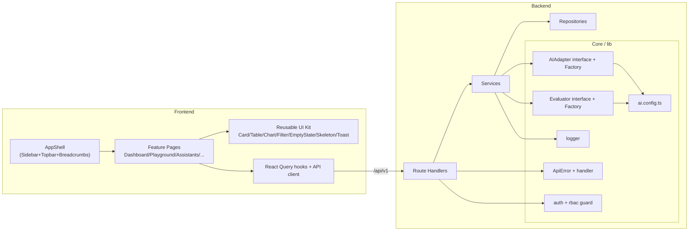
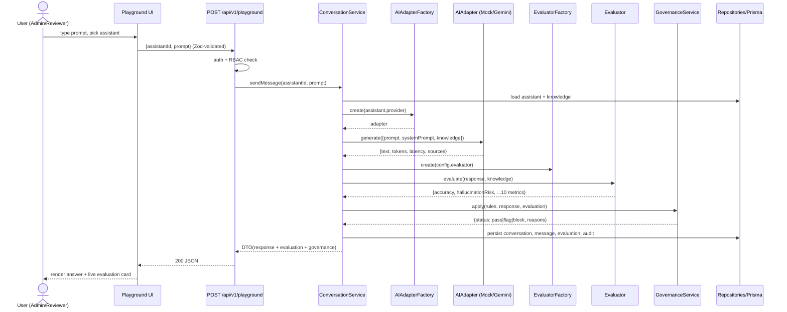
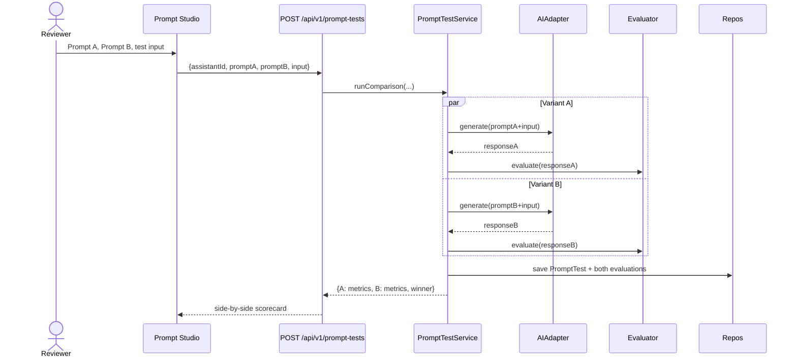
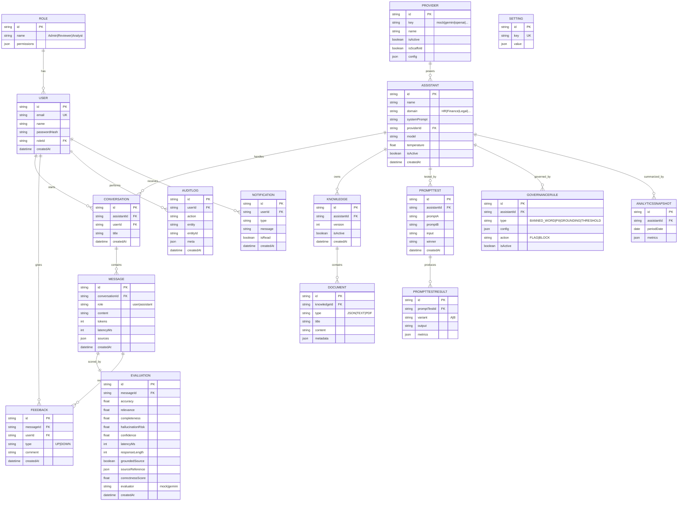

# ConvoInsight AI — Phase 2: Architecture & Design

> **Status:** Phase 2 of 9 — HLD, LLD, Architecture/Component/Sequence/ER Diagrams, DB Design, Folder Structure
> **Depends on:** Phase 1 (PRD + locked decisions: Mock default + Gemini adapter; hybrid evaluator)
> **Date:** 2026-07-02
> *(All diagrams are Mermaid — they render in VS Code with a Mermaid preview extension and on GitHub.)*

---

## 1. High-Level Design (HLD)

### 1.1 Architectural Style
**Layered Clean Architecture** inside a single Next.js 15 App-Router deployment (frontend + API routes co-located, deployable to Vercel as one unit). Dependencies point **inward**: UI → API (controllers) → Services (business logic) → Repositories (data) → Prisma → PostgreSQL. AI/Eval concerns are isolated behind **adapter interfaces** so providers are swappable via config.

```
┌─────────────────────────────────────────────────────────────┐
│                     PRESENTATION (Next.js UI)                 │
│  App Router pages · shadcn/ui components · React Query hooks  │
└───────────────▲───────────────────────────────┬──────────────┘
                │ HTTP (typed fetch)             │
┌───────────────┴───────────────────────────────▼──────────────┐
│                  API LAYER  (/api/v1/* route handlers)         │
│  Zod validation · Auth/RBAC guard · error handler · logging   │
└───────────────▲───────────────────────────────┬──────────────┘
                │ calls                          │ returns DTO
┌───────────────┴───────────────────────────────▼──────────────┐
│                    SERVICE LAYER (business logic)              │
│  AssistantService · ConversationService · EvaluationService   │
│  PromptTestService · GovernanceService · AnalyticsService     │
└──────▲───────────────▲───────────────────▲──────────┬─────────┘
       │               │                   │          │
┌──────┴──────┐ ┌──────┴───────┐  ┌────────┴──────┐ ┌─▼──────────┐
│ REPOSITORY  │ │  AI ADAPTER  │  │  EVALUATOR    │ │  AUDIT/LOG │
│  (Prisma)   │ │  (provider)  │  │  (scoring)    │ │            │
└──────┬──────┘ └──────┬───────┘  └───────┬───────┘ └────────────┘
       │               │                  │
┌──────▼──────┐ ┌──────▼───────┐  ┌───────▼───────────────────────┐
│ PostgreSQL  │ │ Mock / Gemini│  │ Mock evaluator / Gemini judge │
│  (Neon)     │ │ (+ scaffolds)│  │                               │
└─────────────┘ └──────────────┘  └───────────────────────────────┘
```

### 1.2 Key Design Principles applied
| Principle | Where |
|---|---|
| **SOLID / DIP** | Services depend on `AIAdapter` / `Evaluator` / repository **interfaces**, not concretions |
| **Repository Pattern** | All DB access via repositories; services never touch Prisma directly |
| **Service Layer** | Business rules live in services; API routes are thin controllers |
| **Adapter Pattern** | `AIAdapter` + `Evaluator` isolate external AI |
| **Config-based** | `lib/config/ai.config.ts` chooses the active provider — swap = 1 file |
| **Centralized errors** | `ApiError` classes + one error handler wrapper for all routes |
| **API Versioning** | Everything under `/api/v1` |

### 1.3 Provider-Swap Guarantee (the differentiator)
```
AIAdapterFactory.create(config.provider)  →  returns AIAdapter
   'mock'   → MockAIAdapter        (default)
   'gemini' → GeminiAdapter        (real, free tier)
   'openai' | 'claude' | ...       → scaffolded (throws NotImplemented until wired)
```
Business logic calls `adapter.generate(request)` — it never knows which provider answered.

---

## 2. Architecture Diagram (Mermaid)



---

## 3. Component Diagram (Mermaid)



---

## 4. Sequence Diagrams (Mermaid)

### 4.1 Playground: send prompt → generate → evaluate → govern → persist


### 4.2 Prompt Studio: A vs B comparison


---

## 5. Database Design

### 5.1 Design notes
- **Normalized (3NF)**; enums for constrained fields (Role, Provider, GovernanceStatus, FeedbackType).
- **Indexes** on all foreign keys + common filter columns (`createdAt`, `assistantId`, `provider`).
- **Constraints:** FKs with cascade where a child cannot exist without parent (Message→Conversation); `RESTRICT`/`SET NULL` where history must survive (AuditLog actor).
- **Immutability:** `AuditLog` and `Evaluation` are append-only by convention (no update endpoints).
- **Metrics stored numerically** (0–100 / ms / boolean) per Phase 1 definitions.

### 5.2 Entities (16 tables)
| Table | Purpose | Key relations |
|---|---|---|
| **User** | Platform users | belongsTo Role; has Feedback, AuditLogs |
| **Role** | RBAC role (Admin/Reviewer/Analyst) | has Users |
| **Provider** | AI provider config (mock/gemini/…) | has Assistants |
| **Assistant** | A managed AI assistant | belongsTo Provider; has Conversations, Knowledge, PromptTests |
| **Knowledge** | Knowledge base for an assistant | belongsTo Assistant; has Documents; versioned |
| **Document** | A source item (JSON/Text/PDF) | belongsTo Knowledge |
| **Conversation** | A session with an assistant | belongsTo Assistant, User; has Messages |
| **Message** | One turn (user/assistant) | belongsTo Conversation; has Evaluation, Feedback |
| **Evaluation** | 10-metric score of a message | belongsTo Message |
| **PromptTest** | A/B or test-set run | belongsTo Assistant; has PromptTestResults |
| **Feedback** | Thumbs + comment | belongsTo Message, User |
| **GovernanceRule** | A rule (banned word/PII/grounding/threshold) | applied by GovernanceService |
| **AnalyticsSnapshot** | Periodic aggregate metrics | (optional per-assistant) |
| **Setting** | Key/value app + provider settings | — |
| **AuditLog** | Immutable action record | belongsTo User (actor) |
| **Notification** | Threshold-breach alerts | belongsTo User (optional) |

*(PromptTestResult is a child of PromptTest; shown in ER below. Documents realize the PDF/JSON/Text requirement.)*

### 5.3 ER Diagram (Mermaid)



---

## 6. Low-Level Design (LLD) — key contracts

### 6.1 AIAdapter interface (the swap point)
```
interface AIRequest  { prompt, systemPrompt, knowledge[], model?, temperature? }
interface AIResponse { text, tokens, latencyMs, sources[], provider }
interface AIAdapter  { generate(req: AIRequest): Promise<AIResponse>; healthCheck(): Promise<ProviderHealth> }

MockAIAdapter    implements AIAdapter   // matches prompt against knowledge.json
GeminiAdapter    implements AIAdapter   // calls Gemini free-tier REST API
OpenAIAdapter…   implements AIAdapter   // throws NotImplementedError until wired
AIAdapterFactory.create(providerKey): AIAdapter
```

### 6.2 Evaluator interface
```
interface Evaluator { evaluate(response: AIResponse, knowledge: Document[], question: string): Promise<EvaluationResult> }
MockEvaluator        // deterministic: keyword/grounding overlap → 10 metrics
GeminiJudgeEvaluator // optional: asks Gemini to score (free tier)
EvaluatorFactory.create(config.evaluator): Evaluator
```

### 6.3 Repository interface (generic)
```
interface Repository<T> { findById(id): Promise<T|null>; findMany(filter, page): Promise<Paginated<T>>; create(data): Promise<T>; update(id, data): Promise<T>; delete(id): Promise<void> }
```

### 6.4 Service pattern
```
class ConversationService {
  constructor(convRepo, msgRepo, evalRepo, auditRepo, aiFactory, evalFactory, governance) {}  // DI
  async sendMessage(assistantId, prompt, userId): Promise<PlaygroundResult> { ... }
}
```

### 6.5 API contract conventions
- Base: `/api/v1`
- Success: `{ data, meta? }` · Error: `{ error: { code, message, details? } }`
- Pagination: `?page=&pageSize=` → `meta: { page, pageSize, total }`
- All bodies validated with **Zod**; all mutations write an **AuditLog**.

### 6.6 RBAC matrix
| Action | Admin | Reviewer | Analyst |
|---|---|---|---|
| View dashboards/analytics | ✅ | ✅ | ✅ |
| Use Playground | ✅ | ✅ | ❌ |
| CRUD assistants/knowledge/providers | ✅ | ❌ | ❌ |
| Run prompt tests / evaluate / feedback | ✅ | ✅ | ❌ |
| Manage governance rules | ✅ | ❌ | ❌ |
| View audit logs | ✅ | ✅ (read) | ✅ (read) |
| Manage users/settings | ✅ | ❌ | ❌ |

---

## 7. Enterprise Folder Structure (target)

```
convoinsight-ai/
├── prisma/
│   ├── schema.prisma
│   └── seed.ts
├── public/
├── src/
│   ├── app/                          # Next.js App Router
│   │   ├── (auth)/login/page.tsx
│   │   ├── (dashboard)/
│   │   │   ├── layout.tsx             # AppShell (sidebar+topbar)
│   │   │   ├── dashboard/page.tsx
│   │   │   ├── playground/page.tsx
│   │   │   ├── assistants/page.tsx
│   │   │   ├── knowledge/page.tsx
│   │   │   ├── prompt-studio/page.tsx
│   │   │   ├── conversations/page.tsx
│   │   │   ├── evaluations/page.tsx
│   │   │   ├── governance/page.tsx
│   │   │   ├── analytics/page.tsx
│   │   │   ├── feedback/page.tsx
│   │   │   ├── audit-logs/page.tsx
│   │   │   ├── notifications/page.tsx
│   │   │   └── settings/page.tsx
│   │   ├── api/v1/                    # thin route handlers
│   │   │   ├── assistants/route.ts
│   │   │   ├── playground/route.ts
│   │   │   ├── prompt-tests/route.ts
│   │   │   ├── conversations/route.ts
│   │   │   ├── evaluations/route.ts
│   │   │   ├── governance/route.ts
│   │   │   ├── analytics/route.ts
│   │   │   ├── feedback/route.ts
│   │   │   ├── knowledge/route.ts
│   │   │   ├── audit-logs/route.ts
│   │   │   └── auth/[...nextauth]/route.ts
│   │   ├── layout.tsx
│   │   └── globals.css
│   ├── components/
│   │   ├── ui/                        # shadcn primitives
│   │   ├── shared/                    # DataTable, ChartCard, KpiCard,
│   │   │                              # FilterBar, EmptyState, Skeletons,
│   │   │                              # PageHeader, Breadcrumbs, ThemeToggle
│   │   └── features/                  # per-module composed components
│   ├── server/
│   │   ├── services/                  # business logic
│   │   ├── repositories/              # Prisma data access
│   │   └── dto/                       # response DTO mappers
│   ├── lib/
│   │   ├── ai/
│   │   │   ├── adapters/              # mock, gemini, openai(stub)...
│   │   │   ├── ai-adapter.interface.ts
│   │   │   └── ai-adapter.factory.ts
│   │   ├── evaluation/
│   │   │   ├── evaluators/            # mock, gemini-judge
│   │   │   └── evaluator.factory.ts
│   │   ├── config/ai.config.ts        # ← single swap point
│   │   ├── auth/                      # nextauth + rbac guard
│   │   ├── errors/                    # ApiError + handler
│   │   ├── logger/
│   │   ├── validation/                # zod schemas
│   │   ├── db/prisma.ts               # Prisma client singleton
│   │   └── api-client/                # typed fetch + react-query hooks
│   ├── types/                         # shared TS types
│   └── data/knowledge.json            # Mock AI knowledge base
├── docs/                              # phase deliverables
├── .env.example
├── components.json                    # shadcn config
├── tailwind.config.ts
├── next.config.ts
├── tsconfig.json
└── package.json
```

---

## 8. Technology Justifications (Rule 9/10)
| Choice | Why (vs alternatives) |
|---|---|
| **Next.js 15 App Router** | One deploy for UI+API on Vercel; server components; fits 48h |
| **Prisma + PostgreSQL/Neon** | Type-safe queries, migrations, serverless Postgres free tier |
| **NextAuth** | First-class Next.js integration; Credentials provider for seeded demo users; no external auth account needed for MVP |
| **React Query** | Cache/loading/error states out-of-the-box → skeletons & toasts are trivial |
| **Zod** | Single schema for validation + inferred TS types (DRY) |
| **shadcn/ui** | Own the components (no lock-in), themeable dark mode, enterprise look |
| **Adapter + Factory** | Fulfills "swap provider = 1 config file"; testable via Mock |

---

## 9. Phase 2 Trade-offs & Assumptions
- **Monolith over microservices:** simpler, faster, fits Vercel + 48h. (Services are cleanly separated so extraction is possible later.)
- **Credentials auth over OAuth:** avoids Google Cloud setup for the demo; OAuth is a future enhancement.
- **PromptTestResult** added as a child table (not in the original 16) to keep A/B results normalized — noted as an intentional extension.
- **AnalyticsSnapshot** kept minimal (JSON metrics blob) to avoid over-engineering.

---

## 10. Next Phase Overview — Phase 3
**Prisma Schema + Database Setup + Authentication:** turn this ER design into `prisma/schema.prisma`, set up **Neon PostgreSQL** (full click-by-click account + connection-string guide), run migrations, seed roles/users/providers/assistants/knowledge, and wire **NextAuth** (Credentials) with RBAC guards. First real setup steps + API keys begin here.
